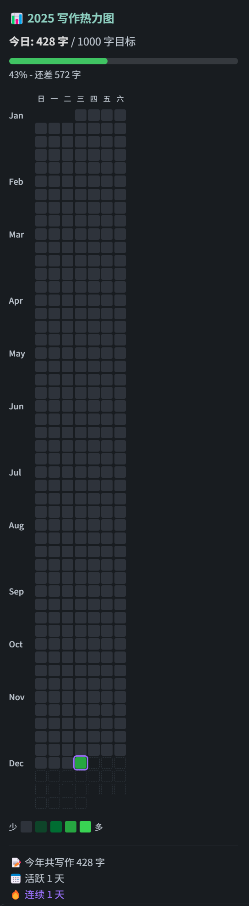

# Daily Heatmap

一个 Obsidian 插件，用于追踪每日写作字数并以热力图形式展示。



## 功能

- 📊 自动统计每日新增写作字数
- 🔥 GitHub 风格的热力图可视化
- 📅 支持查看过去一年的写作记录
- 🌙 自动适配深色/浅色主题
- 🇨🇳 支持中文和英文混合统计

## 安装

### 从 Obsidian 插件市场安装（推荐）

1. 打开 Obsidian 设置
2. 进入 第三方插件 → 浏览
3. 搜索 "Writing Heatmap"
4. 点击安装并启用

### 手动安装

1. 下载最新的 [Release](https://github.com/deutdrsium/obsidian-daily-heatmap/releases)
2. 解压到 `.obsidian/plugins/daily-heatmap/`
3. 重启 Obsidian 并启用插件

## 使用方法

1. 点击左侧边栏的日历图标 📅
2. 或使用命令面板（Ctrl/Cmd + P）搜索"写作热力图"
3. 热力图会显示在右侧边栏

## 统计规则

- ✅ 只统计 `.md` 文件
- ✅ 中文按字符计数，英文按单词计数
- ✅ 自动过滤代码块和 Markdown 语法
- ✅ 只统计新增字数（删除不会减少）

## 开发

```bash
# 安装依赖
npm install

# 开发模式（监听变化）
npm run dev

# 生产构建
npm run build